# Spring Core - Java Brains

## Understanding Inversion of Control (IoC):

```java
public class OrderService{
    public void processPayment(){
        //Order Logic
        // ...
        //Need to call the payment processor
    }
}
public class PaymentService{
    public void processPayment(){
        //Process payment logic
    }
}
```

```java
public class OrderService{
    private PaymentService paymentService;

    public OrderService(){
        paymentService = new paymentService();
    }

    public void processPayment(){
        paymentService.processPayment();
    }
}
public class PaymentService{
    public void processPayment(){
        //Process payment logic
    }
}
```


#### Traditional Control Flow 
- Objects directly managing their dependencies.
- The problem with the above code is payment service is tightly coupled to order service.
- Say in Test environment you want to use test payment service instead of real/prod payment service you have to do lots of refactoring. 


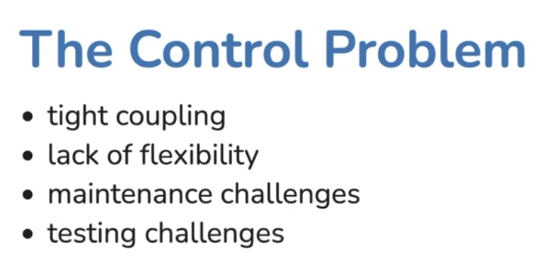


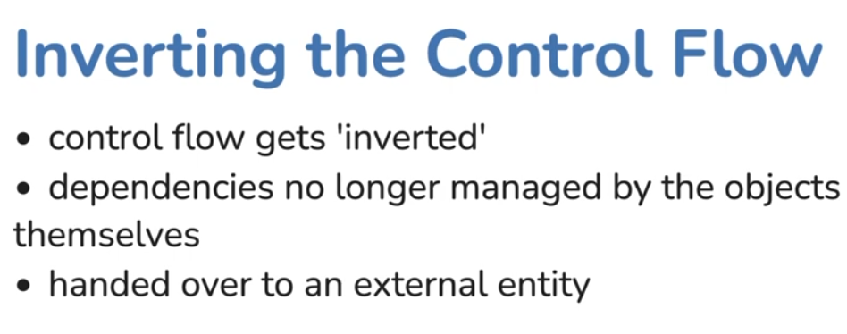

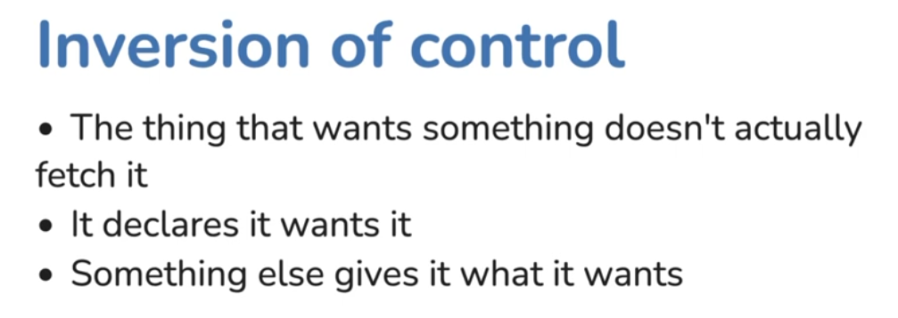


## The problem
```java
public class OrderService{
    private PaymentService paymentService;

    public OrderService(){
        paymentService = new paymentService();
    }

    public void processPayment(){
        paymentService.processPayment();
    }
}
public class PaymentService{
    public void processPayment(){
        //Process payment logic
    }
}
```
## The solution
```java
public class OrderService{
    private PaymentService paymentService;

    public OrderService(PaymentService paymentService){
        this.paymentService = paymentService; 
    }

    public void processPayment(){
        paymentService.processPayment();
    }
}
public class PaymentService{
    public void processPayment(){
        //Process payment logic
    }
}
```
#### Main class
```java
public class Main{
    public static void main(String[] args){
        PaymentService paymentService = new PaymentService();
        OrderService orderService = new OrderService(paymentService);
    }
}
```

#### Test class
```java
public class TestPaymentService implements PaymentService{
    @Override
    public void processPayment(){
        //Test specific process payment logic
    }
}
public class OrderServiceTest{
    @Test
    public void testProcessPayment(){
        PaymentService paymentService = new TestPaymentService();
        OrderService orderService = new OrderService(paymentService);
        
        //Perform test actions and assertions
        orderService.processPayment();

        //Verify test specific behavior
    }
}
```


## Understanding the Spring Application


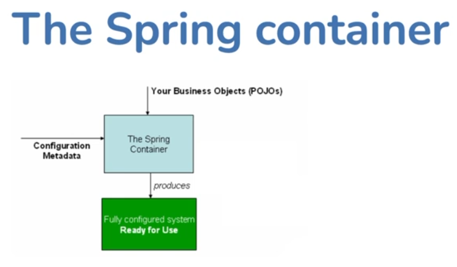


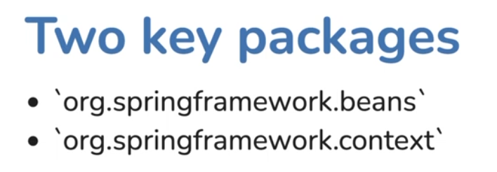

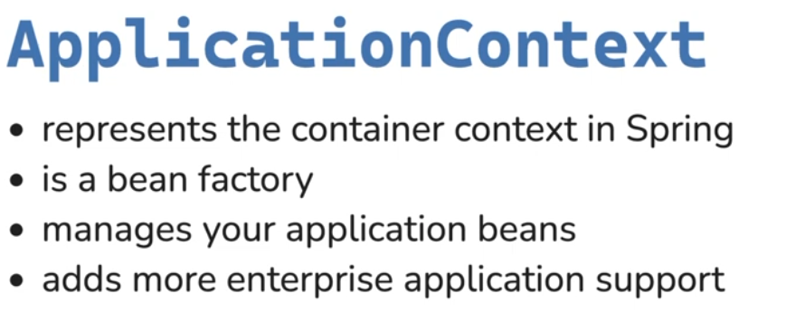

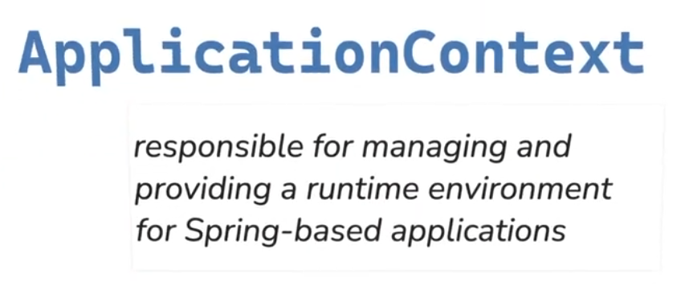

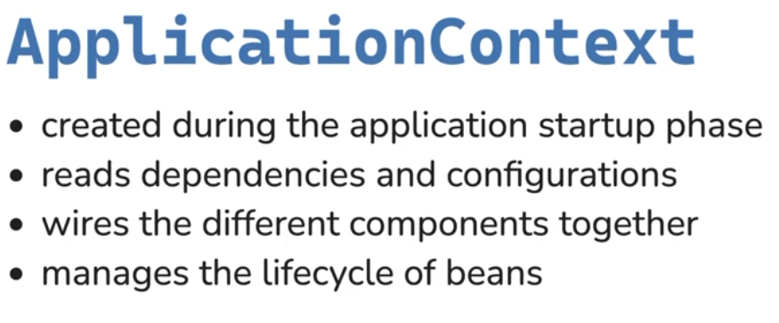

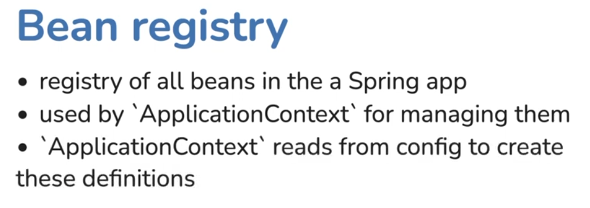


```java
HelloWorldMessage helloWorldMessage1 = new HelloWorldMessage();
HelloWorldMessage helloWorldMessage2 = context.getBean(HelloWorldMessage.class);
```
#### Difference between line 1 and line 2 
- In line 1, you are instantiating a new Object
- In line 2, you are getting the object the spring has already created. 
- The first spring instance is not in Spring context, whereas the second spring instance is in Spring context.


## Dependency Injection
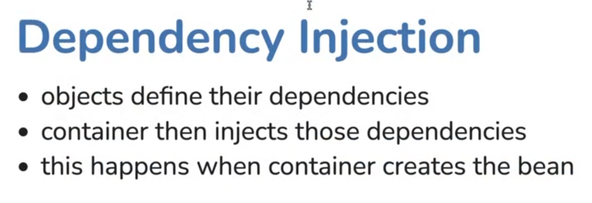
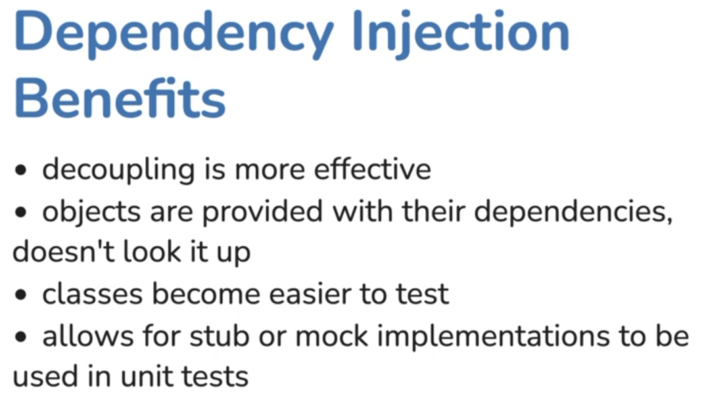


- For autowire to work, the parameter should be a component. 

<br></br>


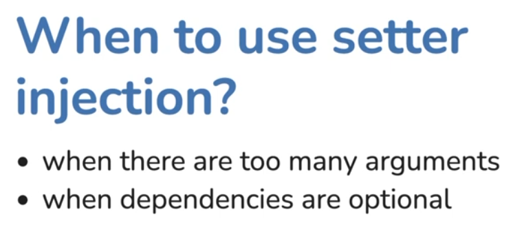


### Field based DI 
- You should be aware of this, but don't use this. 


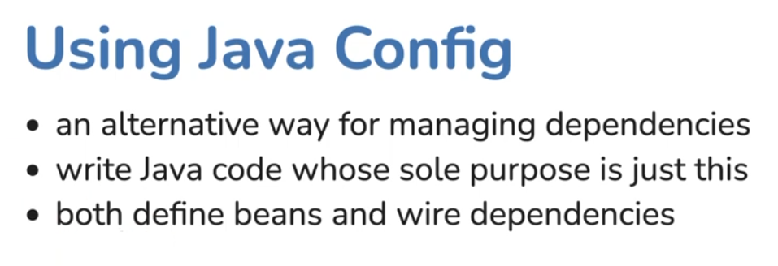

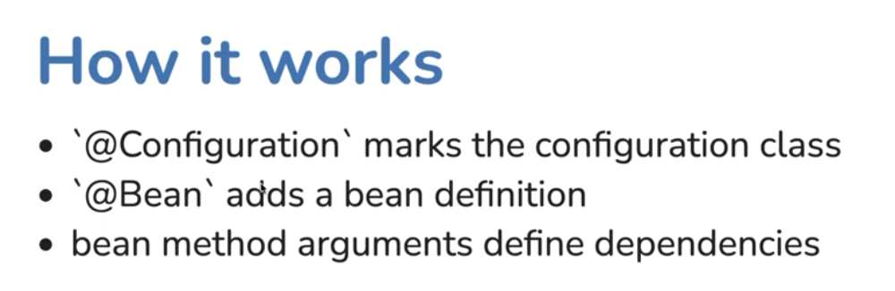

